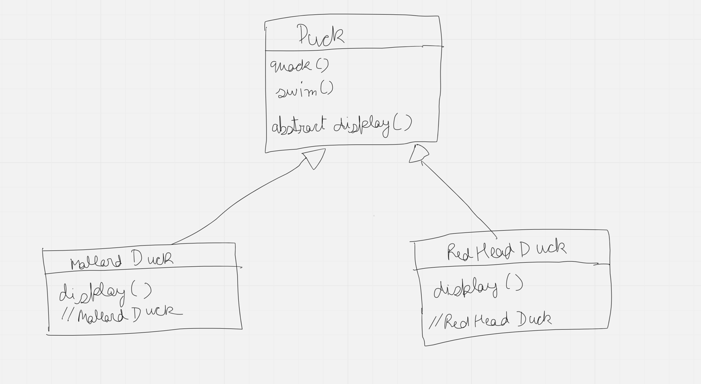
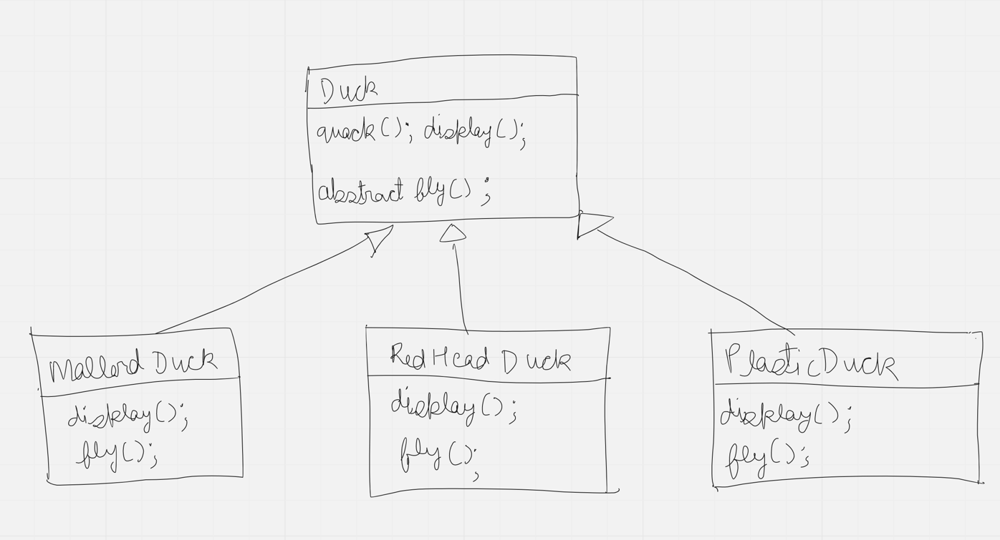
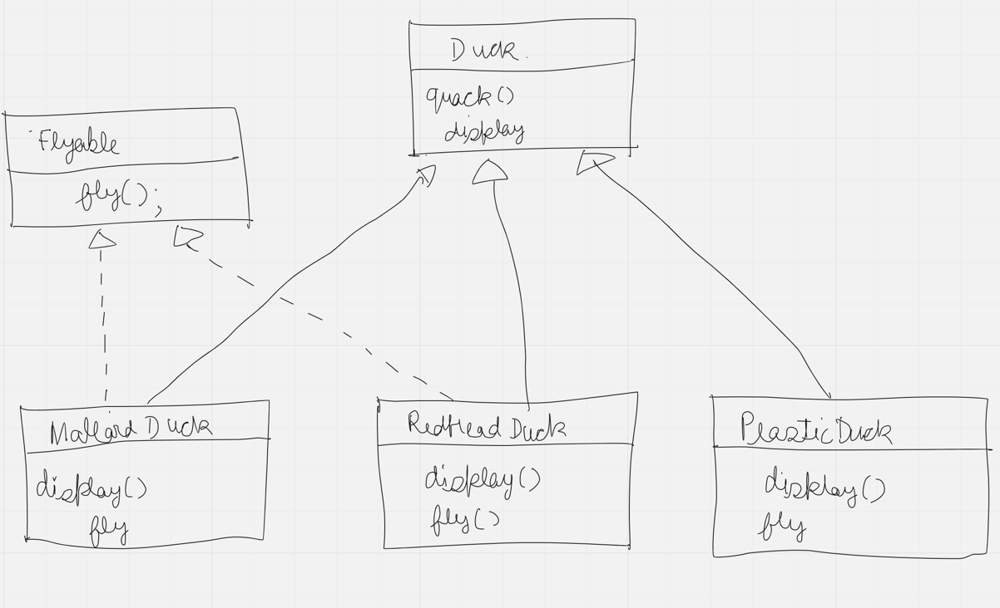
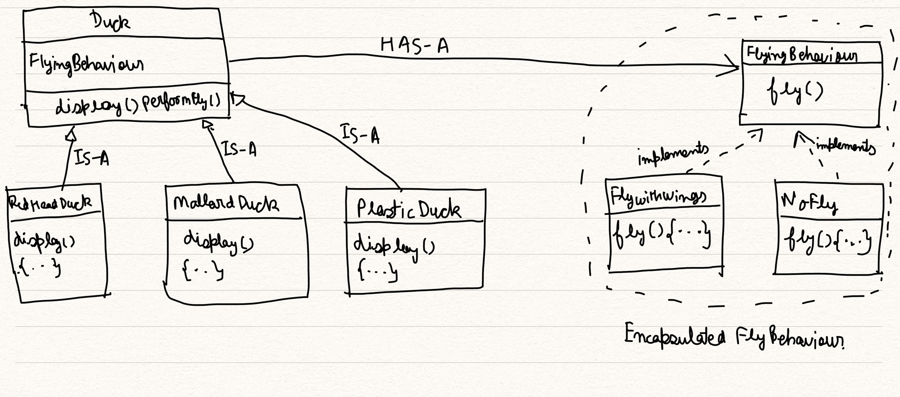

Here we have one Duck class having 3 methods as quack(), swim() and display()

- display() -> abstract method
- MallardDuck and RedHeadDuck are type of Ducks
- They have own implementation of display method, since each subtype of duck would look different.
- New requirement arrives.
- fly() functionality needs to be added

# Problem
### How and where fly() functionality should be added?

# Solution
### Approach 1: Using Inheritance

    - So here we added a new sub-class as PlasticDuck which isn't supposed to fly
    - so we need to override fly() method in sub-class, so that it should meet the requirements
    - But wait, for every new sub-class to be added, let's say WoodenDuck, we again need to override
    - fly() method to do nothing which increases Code Duplicacy
    - and if requirements keep on changing it requires every sub-class to be updated for just simple feature addition
    - Thus it makes hard for code to be reused any more...
### Approach 2: Using Interfaces

    - In this approach we have taken out fly() method out of Duck class
    - Added Flyable Interface having method as void fly();
    - With this approach one can argue that, only subclasses requiring fly functionality needs to implement
    - but what if we need to change behaviour of fly functionality?
    - We need to then change in all the subclasses which require this feature. So no code is reused :(
### Approach 3: Encapsulating varying behaviour 

    - In this approach we have encapsulated varying behaviours of sub-classes viz. FlyingBehaviour as an Interface
    - There could be various unique implementations of FlyingBehaviour such as FlyingWithWings, NoFly etc
    - If any new flying behaviour requirement comes up then we can just add separate interface implementation
    - without changing individual sub-classes implementations
    - Also added FlyingBehaviour as a member of Duck class (denoting has-a relationship)
    - Duck class is now not aware of any varying FlyingBehaviour
    - added performFly() method in Duck class, which in-turn calls fly() of individual FlyingBehaviour implementation
    - added setter for flyingBehaviour in Duck class so that, flyingBehaviour can be changed at runtime
    - and not just bound with constructor initialization